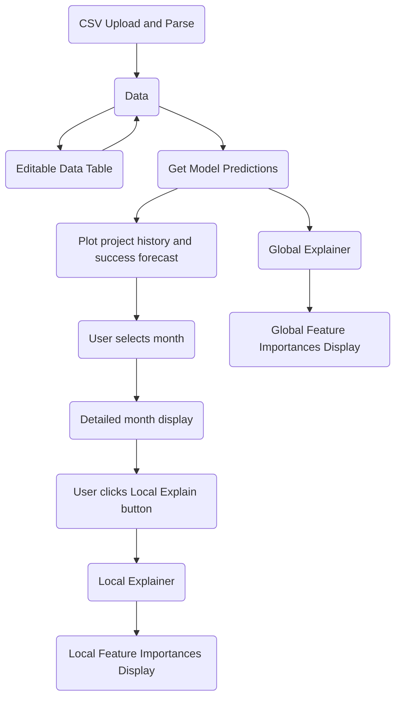

```mermaid
flowchart TD
    upload(CSV Upload and Parse)
    data(Data)
    datatable(Editable Data Table)
	getpreds(Get Model Predictions)
	plot(Plot project history and success forecast)
	monthselect(User selects month)
	monthdisplay(Detailed month display)
	explainbutton(User clicks Local Explain button)
	globalexplainer(Global Explainer)
	globalexpdisplay(Global Feature Importances Display)
	localexplainer(Local Explainer)
	localexpdisplay(Local Feature Importances Display)
	upload --> data
	data --> datatable
	datatable --> data
	data --> getpreds
	getpreds --> plot
	getpreds --> globalexplainer
	globalexplainer --> globalexpdisplay
	plot --> monthselect
	monthselect --> monthdisplay
	monthdisplay --> explainbutton
	explainbutton --> localexplainer
	localexplainer --> localexpdisplay


```